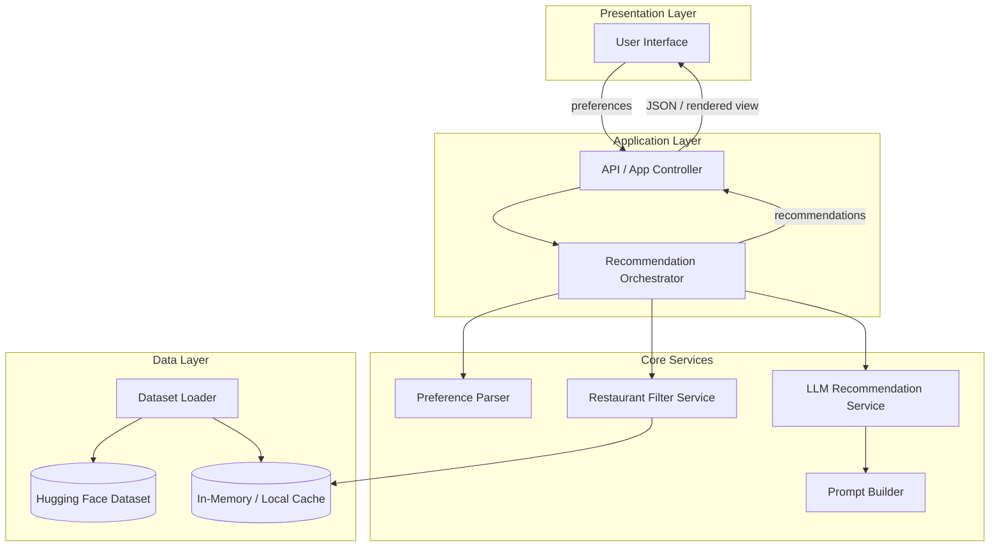
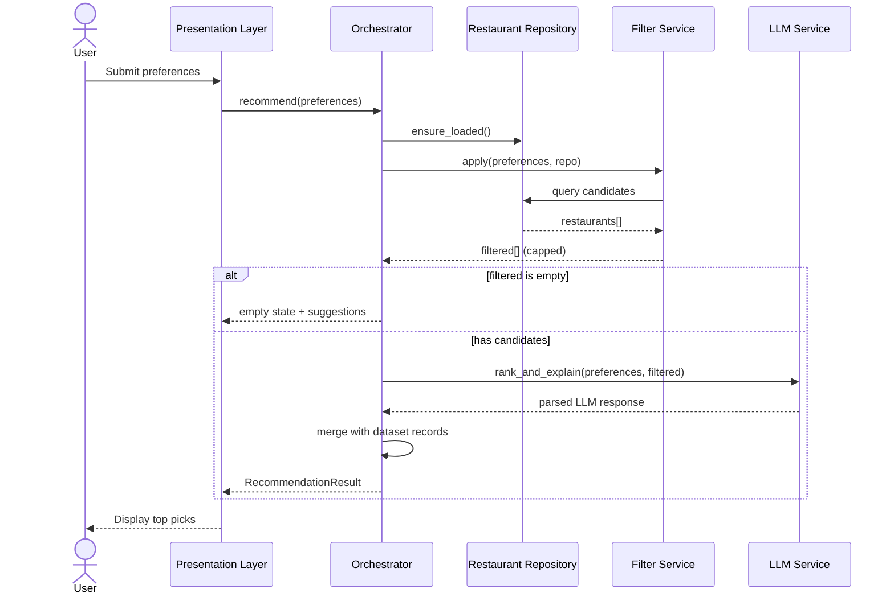
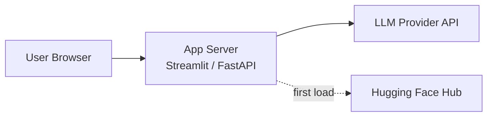

# Architecture: AI-Powered Restaurant Recommendation System

This document describes the technical architecture for the Zomato-inspired recommendation service defined in [`docs/context.md`](context.md). It translates product requirements into components, data flows, interfaces, and implementation guidance.

---

## 1. Architectural Goals

| Goal | How the architecture supports it |
|------|----------------------------------|
| **Preference-driven** | Explicit user preference model drives structured filtering before any LLM call |
| **Grounded recommendations** | LLM only reasons over pre-filtered dataset records; no free-form restaurant invention |
| **Explainable output** | LLM prompt contract requires per-restaurant explanations and optional summary |
| **Clear separation of concerns** | Distinct layers: ingestion, input, filter, LLM, presentation |
| **End-to-end traceability** | Single request path: ingest → input → filter → rank/explain → display |

---

## 2. High-Level System View

The system is a **pipeline architecture** with a thin **orchestration layer** that coordinates data access, filtering, LLM calls, and response formatting.



### Layer mapping (from context)

| Context layer | Architecture component |
|---------------|------------------------|
| Data | `Dataset Loader`, `Preprocessor`, `Restaurant Repository` |
| Input | `Preference Form` / API, `Preference Parser` |
| Filter | `Restaurant Filter Service` |
| LLM | `Prompt Builder`, `LLM Recommendation Service` |
| UI / Output | `Presentation Layer`, `Response Formatter` |

---

## 3. Component Architecture

### 3.1 Data Ingestion Subsystem

**Responsibility:** Load, normalize, and expose restaurant records from the Hugging Face dataset.

| Component | Role |
|-----------|------|
| **Dataset Loader** | Fetches `ManikaSaini/zomato-restaurant-recommendation` via `datasets` (Hugging Face) |
| **Preprocessor** | Cleans nulls, normalizes city/location strings, parses cuisine lists, maps cost to budget bands |
| **Schema Mapper** | Maps raw columns to internal `Restaurant` model |
| **Restaurant Repository** | In-memory query interface over loaded records (filter by location, cuisine, etc.) |

**Design decisions:**

- Load dataset **once at startup** (or on first request) and cache in memory for fast filtering on modest dataset sizes.
- Persist a **processed snapshot** (e.g., Parquet/JSON) optionally to avoid repeated HF downloads in dev/CI.
- All downstream code reads only through the repository—never raw HF rows.

**Extracted fields (minimum):**

- `id` — stable identifier (generated if absent in source)
- `name`
- `location` / `city`
- `cuisines` — list or normalized string
- `average_cost_for_two` or equivalent → derive `estimated_cost` / `budget_band`
- `aggregate_rating` or `rating`
- Optional: `votes`, `address`, `rest_type`, `online_order`, etc., if present in dataset

### 3.2 User Input Subsystem

**Responsibility:** Collect and validate user preferences.

| Field | Type | Validation |
|-------|------|------------|
| `location` | string | Required; match or fuzzy-match known cities from dataset |
| `budget` | enum: `low` \| `medium` \| `high` | Required; mapped to cost ranges per city if needed |
| `cuisine` | string or list | Optional; partial match on cuisine tags |
| `min_rating` | float | Optional; default e.g. 3.0 |
| `additional_preferences` | string | Free text (family-friendly, quick service, etc.) |

**Interfaces:**

- **Web UI:** form with dropdowns (location, budget, cuisine) + numeric rating + textarea for extras
- **API:** `POST /recommendations` with JSON body matching `UserPreferences`

### 3.3 Integration Layer (Filter + Prepare)

**Responsibility:** Reduce candidate set using **deterministic rules** before LLM invocation.

**Filter pipeline (ordered):**

1. **Location filter** — exact or case-insensitive match on city/location
2. **Cuisine filter** — substring or token match on cuisine field
3. **Rating filter** — `rating >= min_rating`
4. **Budget filter** — map `budget` to cost percentiles or fixed bands (e.g., low &lt; ₹500 for two)
5. **Cap candidates** — limit to top N by rating (e.g., 20–50) to control token usage

**Output:** `List[Restaurant]` (structured JSON), never unstructured prose at this stage.

**Why filter first:**

- Grounds the LLM in real rows
- Reduces cost and latency
- Prevents hallucinated venues

### 3.4 Recommendation Engine (LLM)

**Responsibility:** Rank filtered restaurants, generate explanations, optional summary.

| Component | Role |
|-----------|------|
| **Prompt Builder** | Assembles system + user messages: preferences + candidate JSON |
| **LLM Client** | Calls **Groq** Chat Completions API via the official `groq` Python SDK |
| **Response Parser** | Validates JSON schema; falls back to repair or re-prompt on parse failure |
| **Ranker (LLM-assisted)** | Model orders candidates; optional tie-break by rating/cost in code |

**Prompt contract (structured output recommended):**

```json
{
  "summary": "Optional one-paragraph overview of the shortlist",
  "recommendations": [
    {
      "restaurant_id": "string",
      "rank": 1,
      "explanation": "Why this fits location, budget, cuisine, and extras"
    }
  ]
}
```

**Constraints encoded in system prompt:**

- Only recommend restaurants from the provided candidate list (by `id` or `name`)
- Do not invent restaurants or change factual fields (rating, cost)
- Respect user `additional_preferences` when ranking and explaining
- Return at most **K** items (e.g., top 5)

**Failure modes:**

| Failure | Mitigation |
|---------|------------|
| Empty filter results | Return user message: broaden location/cuisine/budget; do not call LLM |
| LLM timeout / error | Retry once; fallback: return top-K by rating with template explanations |
| Invalid JSON | Schema repair prompt or deterministic fallback ranking |

#### Groq integration (Phase 3 default)

| Aspect | Choice |
|--------|--------|
| **Provider** | [Groq](https://console.groq.com/) — fast inference for open models |
| **SDK** | `groq` Python package (`Groq` client) |
| **Auth** | `GROQ_API_KEY` (mapped to `LLM_API_KEY` in app settings) |
| **Default model** | `llama-3.3-70b-versatile` (configurable via `LLM_MODEL`) |
| **Alternates** | `llama-3.1-8b-instant` (lower latency), `mixtral-8x7b-32768` |

**Implementation notes:**

- Use `client.chat.completions.create()` with `response_format={"type": "json_object"}` when the model supports JSON mode for reliable structured output.
- Set `temperature` low (e.g. `0.2`) for consistent ranking; cap `max_tokens` for K explanations + summary.
- On rate limit (429) or timeout: retry once with backoff, then deterministic fallback (architecture failure modes).
- Do **not** call OpenAI for v1; OpenAI-compatible clients are out of scope unless explicitly added later.

### 3.5 Output Display Subsystem

**Responsibility:** Merge LLM output with canonical restaurant data and render for the user.

**Per recommendation card:**

| Field | Source |
|-------|--------|
| Restaurant name | Dataset |
| Cuisine | Dataset |
| Rating | Dataset |
| Estimated cost | Dataset (formatted, e.g., "₹800 for two") |
| AI explanation | LLM |
| Rank | LLM |

Optional: display **summary** paragraph above the list.

---

## 4. Data Models

### 4.1 `Restaurant` (internal)

```text
Restaurant
├── id: string
├── name: string
├── location: string
├── cuisines: list[string]
├── rating: float
├── estimated_cost: float | string
├── budget_band: low | medium | high  (derived)
└── metadata: dict  (optional extra columns)
```

### 4.2 `UserPreferences` (input)

```text
UserPreferences
├── location: string
├── budget: low | medium | high
├── cuisine: string | null
├── min_rating: float
└── additional_preferences: string | null
```

### 4.3 `RecommendationResult` (output)

```text
RecommendationResult
├── summary: string | null
└── items: list[RecommendationItem]

RecommendationItem
├── rank: int
├── restaurant: Restaurant  (enriched from dataset)
└── explanation: string
```

---

## 5. Request Flow (Sequence)



---

## 6. Recommended Project Structure

Logical layout (language-agnostic; Python example shown):

```text
zomoto/
├── docs/
│   ├── context.md
│   ├── architecture.md
│   └── problemStatement.txt
├── src/
│   ├── data/
│   │   ├── loader.py          # HF dataset load
│   │   ├── preprocessor.py    # clean & normalize
│   │   └── repository.py      # in-memory access
│   ├── models/
│   │   ├── restaurant.py
│   │   ├── preferences.py
│   │   └── recommendation.py
│   ├── services/
│   │   ├── filter_service.py
│   │   ├── prompt_builder.py
│   │   └── llm_service.py
│   ├── orchestration/
│   │   └── recommender.py     # end-to-end pipeline
│   └── api/ or app/
│       ├── main.py            # FastAPI or Streamlit entry
│       └── routes.py          # if API
├── config/
│   └── settings.py            # env: API keys, model name, top-K
├── tests/
│   ├── test_filter.py
│   ├── test_preprocessor.py
│   └── test_orchestrator.py
├── .env.example
└── requirements.txt
```

---

## 7. Technology Stack (Suggested)

| Concern | Suggested choice | Rationale |
|---------|------------------|-----------|
| Language | Python 3.11+ | Strong HF `datasets` and LLM SDK ecosystem |
| Dataset | `datasets`, `pandas` | Native Hugging Face integration |
| LLM | **Groq** (`groq` SDK, Chat Completions) | Fast inference; JSON-mode completions for structured ranking |
| API (optional) | FastAPI | Lightweight JSON API for preferences → recommendations |
| UI (optional) | Streamlit or simple React SPA | Fast iteration for demo; Streamlit fits data/ML apps |
| Config | `pydantic-settings`, `.env` | Typed config for API keys and model params |
| Testing | `pytest` | Unit tests for filter and merge logic |

Stack is **not fixed** by context; choose one UI style (monolith Streamlit vs API + frontend) based on team preference.

---

## 8. API Design (if using REST)

### `POST /api/v1/recommendations`

**Request:**

```json
{
  "location": "Bangalore",
  "budget": "medium",
  "cuisine": "Italian",
  "min_rating": 4.0,
  "additional_preferences": "family-friendly, quick service"
}
```

**Response (200):**

```json
{
  "summary": "These spots match your Italian preference in Bangalore with solid ratings and mid-range pricing.",
  "recommendations": [
    {
      "rank": 1,
      "restaurant": {
        "id": "r_123",
        "name": "Example Bistro",
        "cuisines": ["Italian", "Continental"],
        "rating": 4.2,
        "estimated_cost": "₹600 for two",
        "location": "Bangalore"
      },
      "explanation": "Rated above your minimum, fits medium budget, and Italian cuisine."
    }
  ]
}
```

**Response (422):** validation errors on preferences  
**Response (404 / 200 empty):** no matches after filter — include `suggestions` to relax criteria

### `GET /api/v1/health`

Liveness for deployment; optionally checks dataset loaded and LLM configured.

---

## 9. Prompt Architecture

### 9.1 Message structure

1. **System message** — role, grounding rules, output JSON schema
2. **User message** — serialized `UserPreferences` + compact candidate list (id, name, cuisine, rating, cost only)

### 9.2 Grounding rules (must include)

- Candidates are exhaustive; recommendations must be subset of provided IDs
- Factual fields come from input JSON only
- Rank by fit to all preference dimensions, weighting `additional_preferences` in explanations
- Output valid JSON only

### 9.3 Token budget

- Cap candidates at **20–50** rows before prompt build
- Use compact JSON (no pretty-print) in prompt
- Set `max_tokens` on completion to fit K explanations + summary

---

## 10. Configuration & Secrets

| Variable | Purpose |
|----------|---------|
| `HF_DATASET_NAME` | Default: `ManikaSaini/zomato-restaurant-recommendation` |
| `LLM_PROVIDER` | `groq` (default; v1 does not use OpenAI) |
| `LLM_MODEL` | e.g. `llama-3.3-70b-versatile`, `llama-3.1-8b-instant` |
| `LLM_API_KEY` | Groq API key (alias: set `GROQ_API_KEY`; never commit) |
| `GROQ_API_KEY` | Optional explicit env var; preferred name for Groq secret |
| `MAX_CANDIDATES` | Pre-LLM cap (default 30) |
| `TOP_K` | Final recommendations (default 5) |
| `BUDGET_BANDS` | JSON or config mapping low/medium/high to cost ranges |

---

## 11. Cross-Cutting Concerns

### 11.1 Observability

- Log: preference hash, filter count, LLM latency, token usage
- Do not log full API keys or raw PII beyond session needs

### 11.2 Performance

| Stage | Target (indicative) |
|-------|---------------------|
| Dataset load (cold) | Seconds (one-time); warm cache &lt; 100 ms |
| Filter | &lt; 50 ms on in-memory data |
| LLM call | 2–15 s depending on model |
| Total P95 | &lt; 20 s acceptable for demo; optimize with smaller models |

### 11.3 Security

- API keys in environment only
- Rate-limit public endpoints if deployed
- Sanitize `additional_preferences` length to avoid prompt abuse

### 11.4 Testing strategy

| Layer | Test focus |
|-------|------------|
| Preprocessor | Null handling, cuisine parsing, budget band assignment |
| Filter | Location/cuisine/rating/budget combinations; empty set |
| LLM service | Mocked responses; schema validation; fallback path |
| Orchestrator | End-to-end with fixture dataset and mocked LLM |
| UI | Smoke: submit form → cards rendered |

---

## 12. Deployment Topology



**Options:**

1. **Local demo** — single process, Streamlit, Groq API key in `.env`
2. **Container** — Docker image with env-injected secrets; dataset baked or downloaded on start
3. **Cloud** — App on Render/Fly/Railway; no persistent DB required for v1

Version 1 does **not** require a database; in-memory repository is sufficient per context scope.

---

## 13. Success Criteria Traceability

| Context success criterion | Architectural enforcement |
|---------------------------|---------------------------|
| Preferences reflected | Filter + explicit preference object in every LLM prompt |
| Grounded in real data | Repository-only candidates; ID validation on LLM output |
| Actionable LLM output | Structured schema: rank + explanation per item |
| End-to-end flow | Single `RecommendationOrchestrator.recommend()` entry point |

---

## 14. Future Extensions (Out of Scope for v1)

- User accounts and saved preference profiles
- Vector search over reviews/descriptions for semantic “family-friendly” matching
- Caching LLM responses by preference fingerprint
- A/B testing prompt variants
- Multi-city comparison and map-based UI

---

## 15. References

- Project context: [`docs/context.md`](context.md)
- Problem statement: [`docs/problemStatement.txt`](problemStatement.txt)
- Dataset: [ManikaSaini/zomato-restaurant-recommendation](https://huggingface.co/datasets/ManikaSaini/zomato-restaurant-recommendation)
