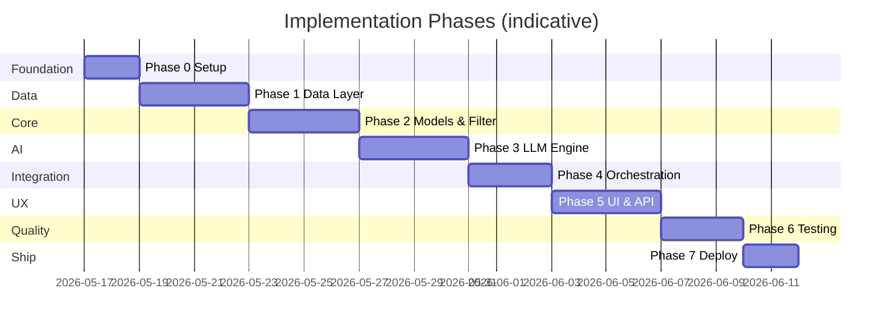
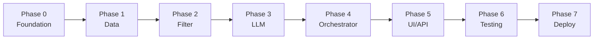

# Phase-Wise Implementation Plan

This plan breaks the AI-powered restaurant recommendation system into ordered phases, derived from [`docs/context.md`](context.md) and [`docs/architecture.md`](architecture.md). Each phase has goals, tasks, deliverables, acceptance criteria, and dependencies.

---

## Plan Overview



| Phase | Name | Maps to context workflow | Primary outcome |
|-------|------|---------------------------|-----------------|
| 0 | Project foundation | — | Runnable repo, config, tooling |
| 1 | Data ingestion | §1 Data Ingestion | Loaded, clean restaurant data in repository |
| 2 | Models & filter layer | §3 Integration Layer | Deterministic candidate shortlist |
| 3 | LLM recommendation engine | §4 Recommendation Engine | Ranked list + explanations (+ summary) |
| 4 | Orchestration | End-to-end pipeline | Single `recommend()` entry point |
| 5 | User input & output display | §2 User Input, §5 Output Display | Working UI or API for end users |
| 6 | Testing & hardening | Success criteria | Reliable, test-covered core paths |
| 7 | Deployment (optional v1) | — | Runnable demo in target environment |

**Estimated total (solo developer):** ~3–4 weeks at moderate pace. Phases 5–7 can overlap slightly (e.g., basic Streamlit while polishing tests).

---

## Phase 0: Project Foundation

### Goal

Establish repository structure, dependencies, configuration, and development workflow so later phases plug in cleanly.

### Tasks

| # | Task | Reference |
|---|------|-----------|
| 0.1 | Initialize Python project (`requirements.txt` or `pyproject.toml`) | Architecture §6, §7 |
| 0.2 | Create folder layout: `src/`, `config/`, `tests/`, `docs/` | Architecture §6 |
| 0.3 | Add `config/settings.py` with `pydantic-settings` (HF dataset name, LLM provider, `MAX_CANDIDATES`, `TOP_K`) | Architecture §10 |
| 0.4 | Add `.env.example` and `.gitignore` (exclude `.env`, caches, `__pycache__`) | Architecture §10, §11.3 |
| 0.5 | Pin core deps: `datasets`, `pandas`, `pydantic`, `pytest`, **`groq`** SDK (Phase 3 LLM) | Architecture §7 |
| 0.6 | Add README with setup: venv, `pip install`, env vars, how to run (placeholder) | — |
| 0.7 | Choose UI mode: **Streamlit monolith** (faster MVP) or **FastAPI + optional frontend** | Architecture §7 |

### Deliverables

- [ ] Project skeleton matching architecture layout
- [ ] Config loads from environment with sensible defaults
- [ ] `pytest` runs (even with zero tests initially)

### Acceptance criteria

- `python -m pytest` executes without import errors
- Settings read `HF_DATASET_NAME` and `LLM_API_KEY` / `GROQ_API_KEY` from env (Groq key required from Phase 3)

### Dependencies

- None

---

## Phase 1: Data Ingestion Layer

### Goal

Implement **Data Ingestion** from context: load Hugging Face dataset, preprocess, expose via in-memory repository.

### Tasks

| # | Task | Component |
|---|------|-----------|
| 1.1 | Implement `Dataset Loader` — `load_dataset("ManikaSaini/zomato-restaurant-recommendation")` | `src/data/loader.py` |
| 1.2 | Inspect raw schema; document column mapping in code comments or small `SCHEMA_MAP` | Loader / preprocessor |
| 1.3 | Implement `Preprocessor`: handle nulls, normalize location/city strings, parse cuisines | `src/data/preprocessor.py` |
| 1.4 | Derive `budget_band` (low/medium/high) from cost field using configurable bands | Preprocessor + settings |
| 1.5 | Assign stable `id` per row if missing | Preprocessor |
| 1.6 | Implement `Restaurant Repository`: load once, `get_all()`, query helpers | `src/data/repository.py` |
| 1.7 | Optional: save/load processed snapshot (Parquet/JSON) for faster dev restarts | Loader |
| 1.8 | Add script or test fixture: print sample rows and unique cities/cuisines | Dev validation |

### Deliverables

- [ ] `Restaurant` records with: `id`, `name`, `location`, `cuisines`, `rating`, `estimated_cost`, `budget_band`
- [ ] Repository returns full dataset after `ensure_loaded()`
- [ ] List of valid locations (for Phase 5 dropdowns)

### Acceptance criteria

- Dataset loads without manual file download beyond HF hub
- No downstream module imports raw Hugging Face rows
- Preprocessor unit tests: null rating/cost, cuisine string → list, budget band assignment

### Dependencies

- Phase 0

### Context / architecture alignment

- Context: extract name, location, cuisine, cost, rating
- Architecture §3.1: loader, preprocessor, schema mapper, repository

---

## Phase 2: Domain Models & Filter Layer

### Goal

Implement **Integration Layer** from context: structured filtering before any LLM call.

### Tasks

| # | Task | Component |
|---|------|-----------|
| 2.1 | Define Pydantic models: `Restaurant`, `UserPreferences`, `RecommendationResult`, `RecommendationItem` | `src/models/` |
| 2.2 | `UserPreferences` validation: required `location`, `budget`; optional `cuisine`, `min_rating`, `additional_preferences` | `preferences.py` |
| 2.3 | Implement `Restaurant Filter Service` pipeline (ordered): | `src/services/filter_service.py` |
| | 2.3a Location filter (case-insensitive) | |
| | 2.3b Cuisine filter (substring/token) | |
| | 2.3c Rating filter (`rating >= min_rating`, default 3.0) | |
| | 2.3d Budget filter (match `budget_band`) | |
| | 2.3e Cap to `MAX_CANDIDATES` by rating desc | |
| 2.4 | Return empty list with clear reason codes (e.g. `NO_LOCATION_MATCH`) for UI messaging | Filter service |
| 2.5 | Add `get_locations()` / `get_cuisines()` on repository for validated dropdowns | Repository |
| 2.6 | Unit tests: each filter step, combined filters, empty result, cap behavior | `tests/test_filter.py` |

### Deliverables

- [ ] `filter_service.apply(preferences, repository) -> list[Restaurant]`
- [ ] Typed models shared by filter, LLM, and orchestrator
- [ ] Test coverage for filter edge cases

### Acceptance criteria

- Given Bangalore + medium + Italian + min 4.0, output is only matching real rows from repository
- Candidate count never exceeds `MAX_CANDIDATES`
- Filter completes in &lt; 50 ms on full in-memory dataset (architecture §11.2)

### Dependencies

- Phase 1

### Context / architecture alignment

- Context §3: filter and prepare data for LLM
- Architecture §3.3: five-step filter pipeline

---

## Phase 3: LLM Recommendation Engine (Groq)

### Goal

Implement **Recommendation Engine** from context using **Groq** as the sole LLM provider: rank filtered candidates, explain each match, optional summary.

### Tasks

| # | Task | Component |
|---|------|-----------|
| 3.0 | Add `groq` to dependencies; set defaults `LLM_PROVIDER=groq`, `LLM_MODEL=llama-3.3-70b-versatile` in settings and `.env.example` | `requirements.txt`, `config/settings.py` |
| 3.1 | Implement `Prompt Builder`: system message (grounding rules + JSON schema) + user message (preferences + compact candidates) | `src/services/prompt_builder.py` |
| 3.2 | Implement **Groq LLM Client** (`Groq().chat.completions.create`, JSON response format) | `src/services/llm_service.py` |
| 3.3 | Enforce structured JSON output schema (see architecture §3.4; Groq `response_format`) | Prompt + parser |
| 3.4 | Implement `Response Parser`: validate IDs against candidates; reject unknown restaurants | LLM service |
| 3.5 | Implement fallbacks: retry once on 429/timeout; template explanations + rating sort if still failing | LLM service |
| 3.6 | Implement `rank_and_explain(preferences, candidates) -> raw LLM payload` | LLM service |
| 3.7 | Unit tests with **mocked** Groq responses (valid JSON, invalid JSON, unknown id) | `tests/test_llm_service.py` |
| 3.8 | Manual smoke test with real `GROQ_API_KEY` on small candidate list (5–10 rows) | Dev |

### Deliverables

- [ ] Groq client configured; no OpenAI dependency required for recommendations
- [ ] Prompt includes all grounding rules (architecture §9.2)
- [ ] Parser returns structured `{ summary?, recommendations: [{ restaurant_id, rank, explanation }] }`
- [ ] Fallback path documented and tested

### Acceptance criteria

- Requests go to Groq with configured model and API key
- LLM never returns IDs not in the candidate list (parser strips or triggers fallback)
- Explanations reference location, budget, cuisine, and `additional_preferences` when provided
- At most `TOP_K` recommendations returned
- Context success: *grounded in real data*, *actionable explanations*

### Dependencies

- Phase 2 (needs `UserPreferences` and filtered `Restaurant` list)
- Groq API key from [Groq Console](https://console.groq.com/keys)

### Context / architecture alignment

- Context §4: rank, explain, optional summarize
- Architecture §3.4 (Groq integration), §9, §10

---

## Phase 4: Orchestration Layer

### Goal

Wire ingest → filter → LLM → merge into a single application entry point matching the architecture sequence diagram.

### Tasks

| # | Task | Component |
|---|------|-----------|
| 4.1 | Implement `RecommendationOrchestrator.recommend(preferences)` | `src/orchestration/recommender.py` |
| 4.2 | Flow: `ensure_loaded()` → filter → if empty return empty state + suggestions → else LLM → merge | Orchestrator |
| 4.3 | **Merge step**: join LLM ranks/explanations with canonical `Restaurant` from repository | Orchestrator |
| 4.4 | Build `RecommendationResult` with `summary` and `items[]` | Orchestrator |
| 4.5 | Empty-state payload: message + hints (relax cuisine, lower rating, change budget) | Orchestrator |
| 4.6 | Add basic logging: filter count, LLM latency (no secrets) | Architecture §11.1 |
| 4.7 | Integration test: fixture repo + mocked LLM → full `RecommendationResult` | `tests/test_orchestrator.py` |
| 4.8 | CLI script: `python -m src.cli` accepts JSON prefs, prints JSON result (dev tool) | Optional |

### Deliverables

- [ ] One public method: `recommend(UserPreferences) -> RecommendationResult | EmptyResult`
- [ ] Merge guarantees display fields (name, cuisine, rating, cost) come from dataset only

### Acceptance criteria

- End-to-end path works without UI (CLI or test)
- Context success: *end-to-end flow ingest → input → filter → LLM → display* (display deferred to Phase 5)
- Invalid LLM IDs do not appear in final output

### Dependencies

- Phases 1, 2, 3

### Architecture alignment

- Architecture §5 sequence diagram
- Architecture §13 success criteria traceability

---

## Phase 5: User Input & Output Display

### Goal

Implement **User Input** and **Output Display** from context: collect preferences and show top recommendations with all required fields.

### Tasks

| # | Task | Option A: Streamlit | Option B: FastAPI |
|---|------|-------------------|-------------------|
| 5.1 | Entry app | `src/app/main.py` (Streamlit) | `src/api/main.py` + `routes.py` |
| 5.2 | Preference form: location, budget, cuisine dropdowns from repository | `st.selectbox` | Request body + validation |
| 5.3 | Min rating slider/input; additional preferences textarea | Streamlit widgets | Pydantic model |
| 5.4 | Submit → call `orchestrator.recommend()` | Button handler | `POST /api/v1/recommendations` |
| 5.5 | Results UI: summary (if present) + cards per item | `st.expander` / columns | JSON response |
| 5.6 | Each card: name, cuisine, rating, estimated cost, explanation, rank | Context §5 | Same fields in JSON |
| 5.7 | Empty state UI with suggestions from orchestrator | `st.info` | 200 + empty payload |
| 5.8 | Loading spinner during LLM call | `st.spinner` | Async optional |
| 5.9 | `GET /api/v1/health` (if API) | — | Dataset loaded + LLM configured |

### Deliverables

- [ ] Runnable app: user can submit preferences and see top recommendations
- [ ] All five output fields visible per restaurant (context §5)
- [ ] Health endpoint (if FastAPI)

### Acceptance criteria

- Demo flow: Bangalore, medium, Italian, 4.0+, "family-friendly" → readable cards with AI explanations
- Preferences reflected in results (context success criterion)
- Form validation prevents empty location/budget

### Dependencies

- Phase 4

### Context / architecture alignment

- Context §2 User Input, §5 Output Display
- Architecture §3.2, §3.5, §8

---

## Phase 6: Testing & Hardening

### Goal

Meet **success criteria** from context with automated tests, error handling, and operational polish.

### Tasks

| # | Task | Focus |
|---|------|-------|
| 6.1 | Complete `test_preprocessor.py` | Nulls, cuisines, budget bands |
| 6.2 | Complete `test_filter.py` | All filter combinations |
| 6.3 | Complete `test_llm_service.py` | Mocks, fallbacks, schema |
| 6.4 | Complete `test_orchestrator.py` | E2E with fixtures |
| 6.5 | UI smoke test checklist (manual or Playwright optional) | Submit → cards |
| 6.6 | Sanitize `additional_preferences` max length | Architecture §11.3 |
| 6.7 | Handle LLM timeout gracefully (user-facing message) | Architecture §3.4 |
| 6.8 | Document known limitations in README | — |
| 6.9 | Document `GROQ_API_KEY` setup in README; mock Groq in unit tests | No OpenAI key required |

### Deliverables

- [ ] `pytest` suite green locally
- [ ] README test section: how to run tests and mock LLM
- [ ] Error messages user-friendly for empty filter and LLM failure

### Acceptance criteria

| Context criterion | Verification |
|-------------------|--------------|
| Preferences reflected | Filter + manual UI test |
| Grounded in real data | Parser tests + no unknown IDs in orchestrator test |
| Actionable LLM output | Schema tests + UI shows rank + explanation |
| End-to-end flow | Orchestrator + UI smoke test |

### Dependencies

- Phase 5 (or Phase 4 for backend-only tests)

---

## Phase 7: Deployment (Optional for v1)

### Goal

Package and run the application in a shareable environment per architecture §12.

### Tasks

| # | Task |
|---|------|
| 7.1 | Add `Dockerfile` (Python slim, install deps, expose port) |
| 7.2 | Document env vars for container runtime |
| 7.3 | Choose host: local, Render, Fly.io, or Railway |
| 7.4 | Cold start: dataset download on first request or bake snapshot in image |
| 7.5 | Verify health check and one live recommendation request |
| 7.6 | Optional: rate limit public API if exposed |

### Deliverables

- [ ] Deployed URL or documented `docker run` command
- [ ] Secrets only via platform env, not in image

### Acceptance criteria

- App starts, loads data, returns recommendations with valid API key
- P95 latency acceptable for demo (&lt; 20 s per architecture §11.2)

### Dependencies

- Phases 0–6

---

## Phase Dependency Graph



**Parallelization tips:**

- After Phase 1: explore dataset columns and build location/cuisine lists while starting Phase 2 models.
- Phase 3 prompt design can start on paper while Phase 2 filter is coded.
- Phase 6 unit tests for Phases 1–2 can be written alongside Phases 2–3, not only at the end.

---

## Milestone Checklist (MVP Definition)

Use this as the minimum shippable product:

- [ ] **M1 — Data ready:** Repository serves normalized restaurants from Hugging Face.
- [ ] **M2 — Filter ready:** Preferences produce a capped candidate list or empty state.
- [ ] **M3 — AI ready:** LLM returns ranked explanations for candidates only.
- [ ] **M4 — Pipeline ready:** Orchestrator runs full flow via CLI or test.
- [ ] **M5 — Product ready:** UI/API shows top picks with name, cuisine, rating, cost, explanation.
- [ ] **M6 — Quality ready:** Core pytest suite passes; README documents setup and limits.

---

## File Creation Order (Quick Reference)

Implement files in this order to minimize blocked work:

```text
1. config/settings.py
2. src/models/restaurant.py, preferences.py, recommendation.py
3. src/data/loader.py → preprocessor.py → repository.py
4. src/services/filter_service.py
5. src/services/prompt_builder.py → llm_service.py
6. src/orchestration/recommender.py
7. src/app/main.py  OR  src/api/main.py + routes.py
8. tests/* (incrementally from step 3 onward)
9. Dockerfile (Phase 7)
```

---

## Risk Register

| Risk | Phase | Mitigation |
|------|-------|------------|
| Dataset schema differs from docs | 1 | Inspect HF dataset early; adjust `SCHEMA_MAP` |
| No matches after strict filters | 2, 4 | Empty state + suggestions; document typical cities |
| LLM invents restaurants | 3, 4 | ID validation; grounding prompt; fallback |
| High API cost / latency | 3 | Cap candidates; use `llama-3.1-8b-instant` on Groq for faster/cheaper runs |
| Budget bands inaccurate | 1, 2 | Tune `BUDGET_BANDS` from dataset percentiles per city |
| HF download fails offline | 1, 7 | Commit processed snapshot for CI/deploy |

---

## Out of Scope (Per Architecture §14)

Track as future phases, not v1:

- User accounts and saved profiles
- Vector / semantic search for free-text preferences
- LLM response caching
- A/B prompt testing
- Multi-city map UI

---

## References

- [`docs/context.md`](context.md) — objectives, workflow, success criteria
- [`docs/architecture.md`](architecture.md) — components, models, API, testing, deployment
- [`docs/problemStatement.txt`](problemStatement.txt) — original problem statement
- Dataset: https://huggingface.co/datasets/ManikaSaini/zomato-restaurant-recommendation
